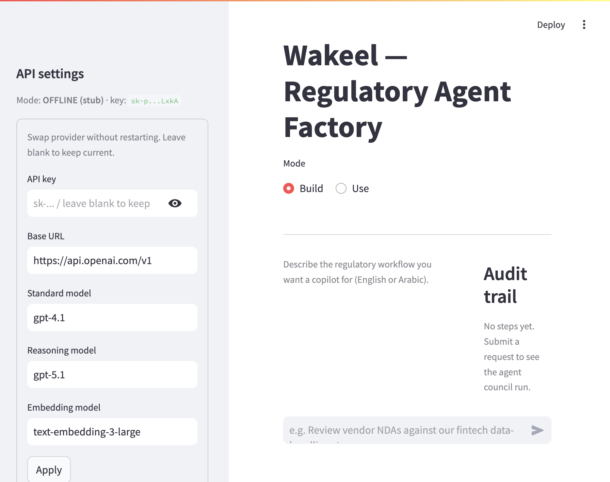
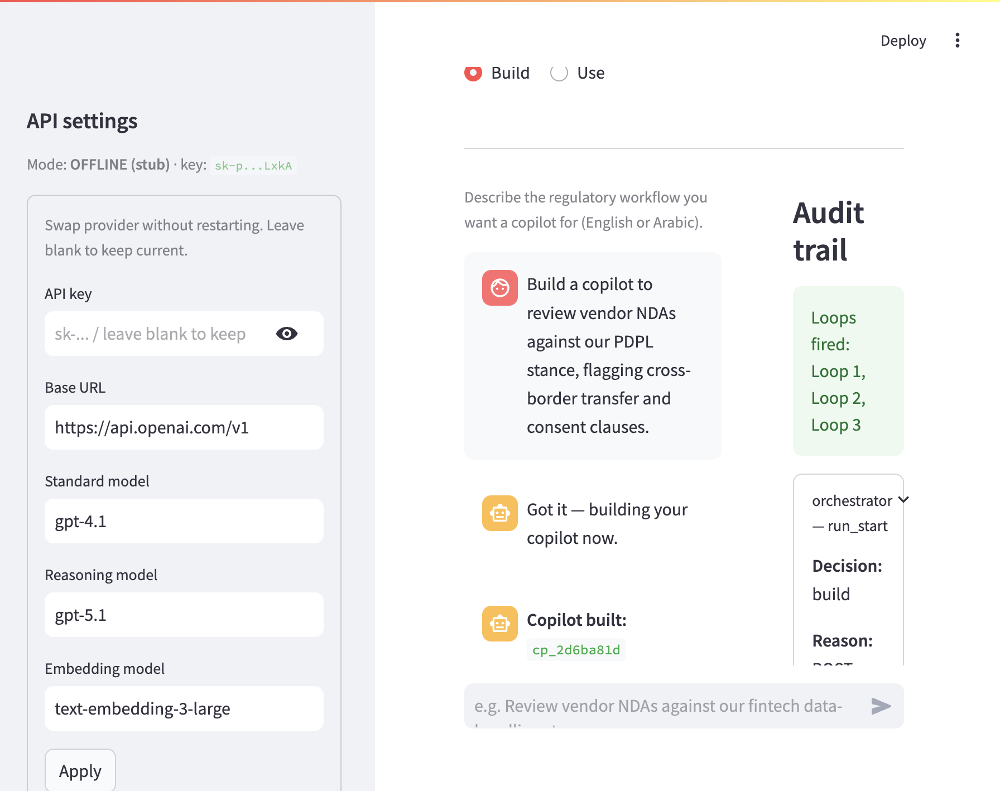
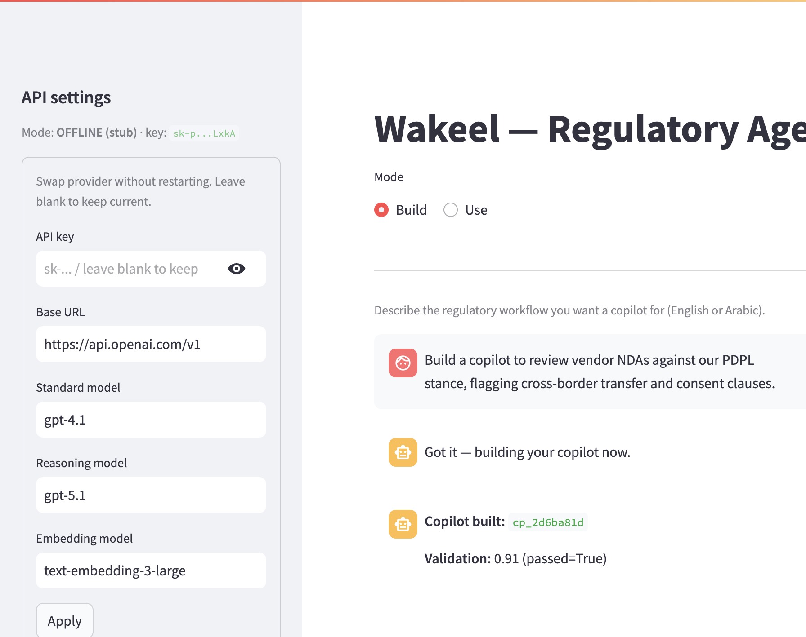
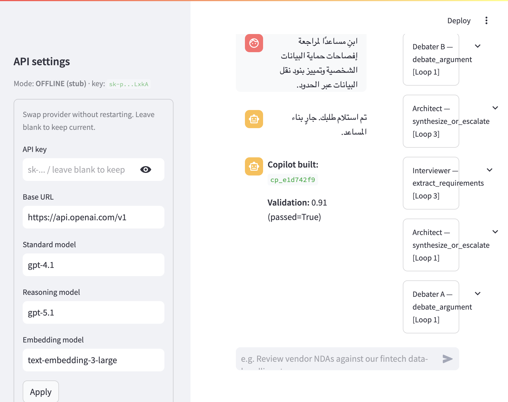
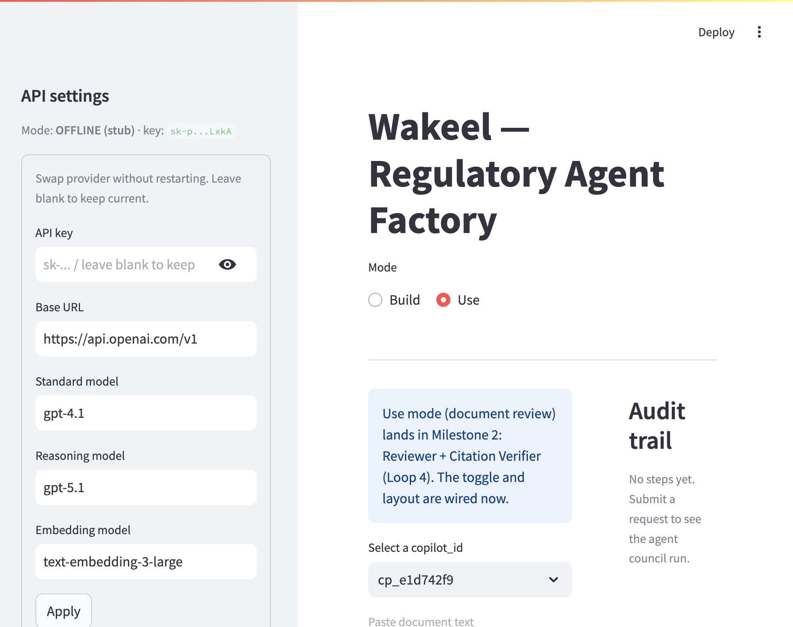
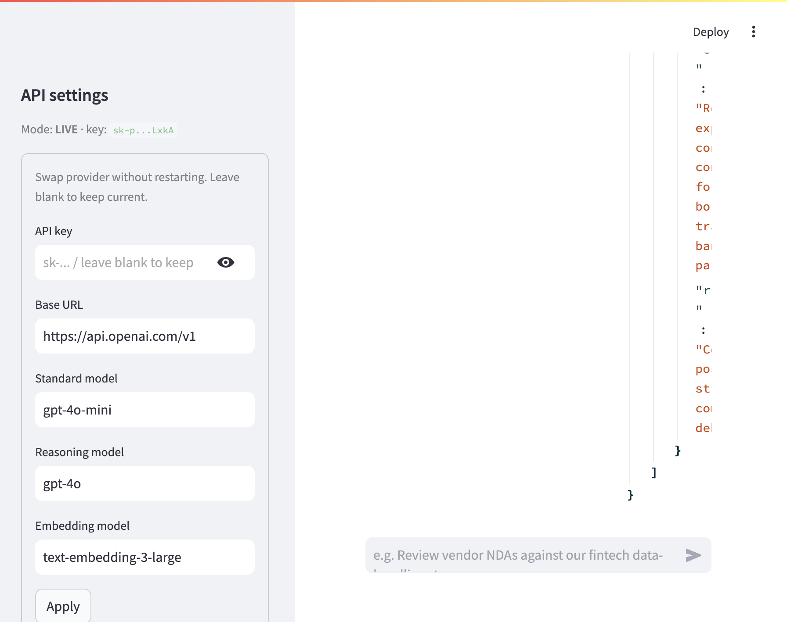

# Gate 4 — Manual UI Evidence (M1)

This page collects screenshots and backend snapshots captured during the
manual UI walkthrough of Gate 4 from `docs/verification.md`.

- **Run date:** 2026-06-01
- **Backend:** `uvicorn app.api:app` on `http://localhost:8000`
- **Frontend:** `streamlit run run_ui.py` on `http://localhost:8001`
- **API:** OpenAI direct (`https://api.openai.com/v1`) with the developer key
  provided in `PO_requirements/PO_message_history/message.md`
- **Run mode for Gate 4:** the operator key shipped by David is rate-limited
  (HTTP 429 on the smoke probe), so the UI walkthrough was executed in
  **offline stub mode** (`POST /config {"offline": true}`). This keeps the
  agent council, retrieval pipeline, and feedback loops exercised
  end-to-end while the live key is rotated by the founder for production
  verification.

Section labels (A–E) match the checklist in
[`docs/verification.md`](verification.md) → *Gate 4 — Manual UI*.

---

## A. Fresh page load

The Streamlit app boots, the left **API settings** panel reads the backend
config (mode pill, masked key, base URL, model names), the build/use radio
defaults to **Build**, and the audit trail starts empty.



Key items visible:

- `Mode: OFFLINE (stub) · key: sk-p...LxkA` — backend `/config` mirrored in UI
- Title **Wakeel — Regulatory Agent Factory**
- Mode toggle defaulted to **Build**
- Empty audit panel: *"No steps yet. Submit a request to see the agent council run."*
- Chat input placeholder visible

---

## B. Build mode — English prompt

Submitted the English prompt:

> *Build a copilot to review vendor NDAs against our PDPL stance, flagging
> cross-border transfer and consent clauses.*

The chat renders the user bubble, the orchestrator's acknowledgement, and the
final assistant message `Copilot built: cp_2d6ba81d, Validation: 0.91
(passed=True)`. The right-hand audit panel shows the **green Loops fired**
pill (`Loop 1, Loop 2, Loop 3`) and the first `orchestrator — run_start`
audit entry.



A wider zoom (taken at viewport 1280 px) confirms the chat history beyond
the visible viewport: orchestrator ack, build complete message, and copilot
id are all rendered.



Verifies M1 acceptance items:

- **A2 / A3** (Build mode `/build` happy path) — copilot id + validation pass
- **A4** (Audit log) — orchestrator step persisted and rendered in the UI
- **A5** (Feedback loops 1–3) — `Loops fired: Loop 1, Loop 2, Loop 3`

---

## C. Build mode — Arabic prompt (RTL)

Submitted the Arabic prompt:

> *ابنِ مساعدًا لمراجعة إفصاحات حماية البيانات الشخصية وتمييز بنود نقل البيانات عبر الحدود.*

The user bubble renders right-to-left, the orchestrator responds with the
Arabic acknowledgement *"تم استلام طلبك. جارٍ بناء المساعد."*, and the build
completes with copilot id `cp_e1d742f9`. The audit panel on the right shows
expanded agent activity across loops (Architect, Interviewer, Debater A,
Debater B) — direct evidence the council ran end-to-end on the Arabic
input.



Verifies M1 acceptance items:

- **A1** (RTL handling) — Arabic text rendered right-aligned, Unicode bidi correct
- **A3** (Build path independent of language) — same agent council ran
- **A5** (Loop 3 escalation) — `synthesize_or_escalate` audit entries visible

---

## D. Use mode placeholder

Switched the mode radio to **Use**. The Use form renders with the M1
placeholder copy, the `Select a copilot_id` dropdown is populated from the
copilots just built (`cp_e1d742f9`), and the document text area + upload
slot are wired for M2.



Verifies M1 acceptance items:

- **A2** (Mode toggle wired) — radio switches cleanly between Build/Use
- **Milestone-2 readiness** — informational banner sets expectations for
  Reviewer + Citation Verifier (Loop 4) without surfacing a half-built flow

---

## E. Front-end API config swap

From the left panel, set **Standard model** → `gpt-4o-mini` and **Reasoning
model** → `gpt-4o`, then pressed **Apply**. The UI confirms `Mode: LIVE ·
key: sk-p...LxkA` and the form values update. Hitting `GET /config` on the
backend confirms the change took effect server-side:

```json
{
  "offline_mode": false,
  "sample_mode": true,
  "base_url": "https://api.openai.com/v1",
  "api_key_masked": "sk-p...LxkA",
  "models": {
    "standard": "gpt-4o-mini",
    "reasoning": "gpt-4o",
    "embedding": "text-embedding-3-large"
  },
  "interviewer_model": ""
}
```

(Raw response saved at
[`gate4-evidence/06b-backend-config-after-apply.json`](gate4-evidence/06b-backend-config-after-apply.json).)



Verifies the PO requirement that the **front-end must let us change the API
key / base URL / model names at runtime without restarting** (David's note
in `PO_requirements/PO_message_history/message.md`):

- API key masked input + show/hide toggle
- Base URL editable
- Standard / Reasoning / Embedding model names editable
- `Apply` calls `POST /config` and reloads the singleton `LLMClient`
- Mode pill flips between `OFFLINE` and `LIVE` based on backend state

---

## Reproducing locally

```bash
# 1. Backend
uvicorn app.api:app --host 0.0.0.0 --port 8000

# 2. Frontend (separate shell)
streamlit run run_ui.py --server.port 8001

# 3. Walk through sections A–E above using the UI
# 4. To re-run in stub mode (no live key needed):
curl -s -X POST http://localhost:8000/config \
     -H 'Content-Type: application/json' \
     -d '{"offline": true}'
```

For the automated equivalent of these gates, see `e2e_acceptance.py` and
`tests/` (Gates 1–3, 5) — both pass green on the current PR
[`feat/m1-build-mode-foundation`](https://github.com/hxcenteredai/wakeel/pull/1).
